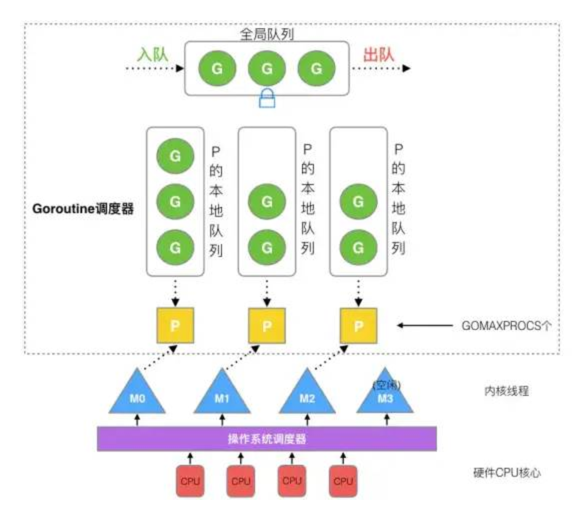

package study

关于cpu的调度以及进程，线程，协程的理解

根据操作系统处理的业务复杂程度作为主干，进行展开：
1.早期的单线程串行处理。cpu负责处理，每个执行的程序都算是一个进程，这些进程需要串行运行处理，容易发生阻塞等待，任务处理能力低；
2.支持多并发处理能力的cpu调度机制：当执行某个进程阻塞时，由cpu调度器调度到另外一个进程处理，增加cpu使用率；
3.关于cpu调度器：
    由cpu调度器去匹配用户空间（即协程们）与内核空间（线程）之间的对应，多对多的关系
4.引出go的被废弃的协程调度器：
    由G（go协程）和M（线程）组成；
    包含：全局的协程队列，当多个M去调用执行放回操作G都必须上锁操作，较为悲观；由于上锁的导致的资源竞争，会在调度过程中产生较大的时间开销；
5.引出GMP模型
    由G（go协程）、M（线程）和P（处理器）组成；
    关于P：包含处理G的资源，当M想处理G时，需要从P中获取相应的资源；

    https://blog.csdn.net/S_FMX/article/details/115771606?utm_medium=distribute.pc_relevant.none-task-blog-2~default~baidujs_baidulandingword~default-1-115771606-blog-115489545.pc_relevant_default&spm=1001.2101.3001.4242.2&utm_relevant_index=4